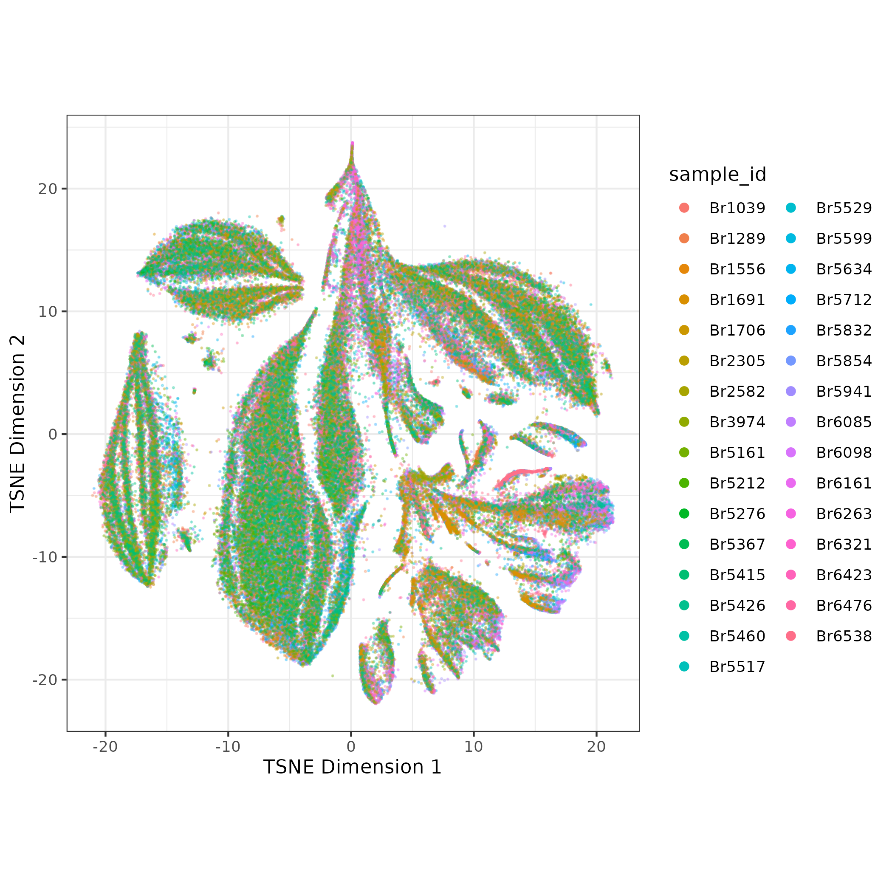
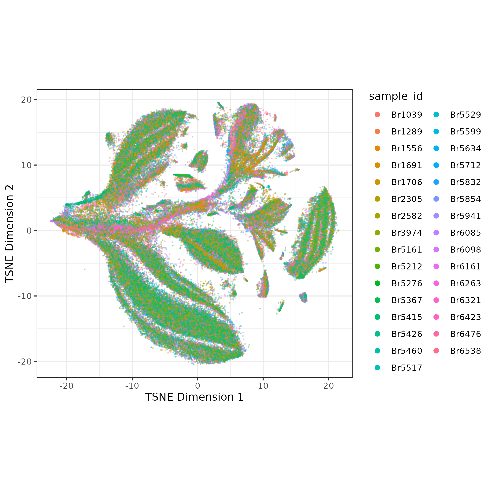
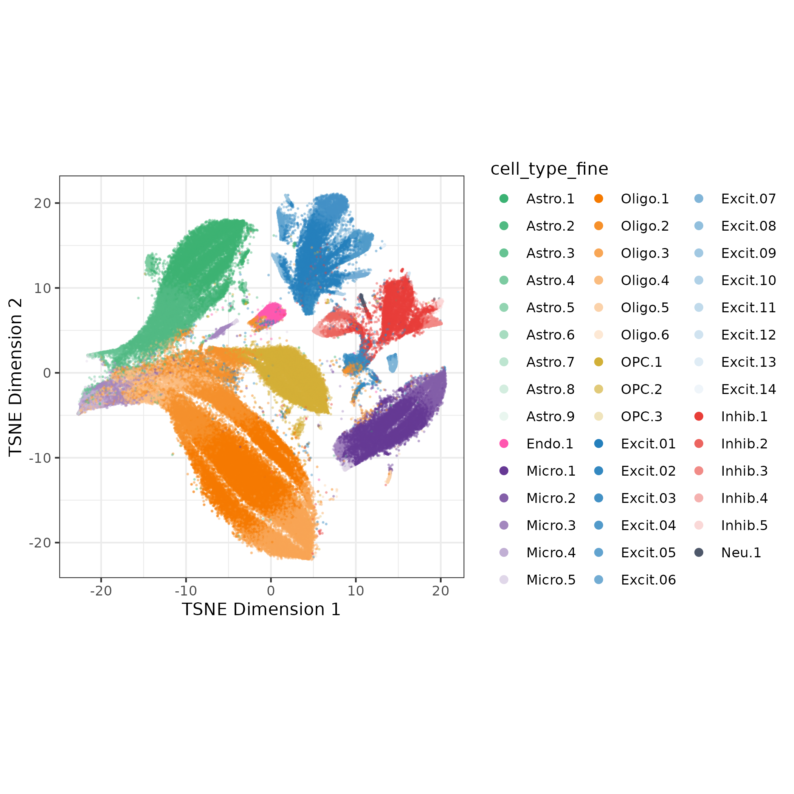

# Introduction

The goal of cluster quality control (QC) is to further identify low quality nuclei by running a preliminary clustering step, then dropping clusters with poor QC scores (high mitochondrial rate, high doublet score, low sum UMI, or low detected genes). After cluster QC, the data is re-clustered with the aim that the second 'optimal' clustering is then driven by cell type identity not quality signal.

# Get Ready:

## 1. Nuclei QC

Cluster QC is run after 'nuclei' QC where droplets/nuclei are quality controlled in the following process:

1.  Evaluate each droplet for if it contains nuclei or only ambinet RNA (an 'empty droplet') with `DropletUtils::emptyDrops()` , DROP empty droplets, KEEP droplets containing nuclei
2.  Calculate the double score for each nuclei with `scDblFinder::scDblFinder()` ([see scDBLFinder docs](https://plger.github.io/scDblFinder/index.html)), but **don't drop** yet - we'll evaluate this in the cluster QC step
3.  Nuclei are evaluated **by sample** for high mitochondrial rate, low sum UMI, or low detected genes with `scuttle::isOutlier()` , DROP nuclei that are over cutoff for any metrics, KEEP nuclei that pass all metrics
    -   It may be reasonable to set a hard cutoff for mitochondrial rate - we'll discuss more

After nuclei QC, you'll retain high QC nuclei with double scores, ready for clustering! But notably when evaluating brain snRNA-seq data, neurons have high levels of transcriptional activity than glia leading to different distributions of these QC metrics. This is visible in the bi-modal distributions of the nuclei sum UMI QC plots. Some of the nuclei that look fine might be low quality neurons, but we don't know which neurons are neurons yet 🕵️! To understand what type of cells these nuclei are we'll have to cluster.


## 2. Feature Selection, Dimension Reduction, and Batch Correction

To cluster the nuclei we'll need batch-corrected principal components (PCs). We won't get in to too much detail here but our current method is GLM-PCA but quickly:\

1.  Select top 2k genes (features) deviating from binomial model `scry::devianceFeatureSelection()` then calculate deviance residuals with `scry::nullResiduals()`
2.  Reduce dimensions with PCA, calculate UMAP and TSNE for visualization\
    {width="400"}
3.  Run batch correction with Harmony- the batch correction is subtle in this example\
    {width="400"}

We will use the batch-corrected PCAs for clustering.

# Cluster Quality Control

## 1. Preliminary Clustering

The next step is to cluster the nuclei. There are many ways to optimize clustering, but to keep things simple, I recommend using a finer cluster resolution (for more but smaller clusters), but still a manageable number (\~50 clusters).

Previously we've used single-nearest-neighbors + walktrap clustering. For larger data we've started using Leiden clustering, possible starting parameters to use there are k=25, resolution = 0.3.

I used SSN with k=10, then walktrap on the ERC data (140k nuclei after QC) resulting in 44 clusters:

```         
## running single-nearest-neighbors k =10
snn.gr <- bluster::buildSNNGraph(sce, k = k, use.dimred = "HARMONY")

## Run walk trap clustering
clusters <- igraph::cluster_walktrap(snn.gr)$membership
table(clusters)

# clusters
#     1     2     3     4     5     6     7     8     9    10    11    12    13 
#  7364  1309  2884  2949 10363 13986  1909   809   596   160   919 15594   694 
#    14    15    16    17    18    19    20    21    22    23    24    25    26 
#   770   839  1672  2243  8680  8484 13680   216  4745  8787    39   420  3117 
#    27    28    29    30    31    32    33    34    35    36    37    38    39 
#   341   396   459   668 22929   774   325   137   197    44   139    41    67 
#    40    41    42    43    44 
#    73    84    25   178    14 
```

## 2. Cluster Cell Type Annotation

Next we want a **preliminary** cell type annotation for each cluster. Cell type annotation can be tricky and time consuming, especially on low quality clusters. Here we just want to focus on classifying nuclei clusters as neurons or glia (cell_type_class).

To help with this process I've used the automated cell type identification tool [ScType](https://github.com/IanevskiAleksandr/sc-type). I had to make some adaptions to run with `SingleCellExperiment` data, see [my code here](https://github.com/LieberInstitute/LFF_spatial_ERC/blob/devel/code/04_snRNA-seq/08_sctype_prelim.R).

ScType scores each cluster based on expression of marker genes from a tissue-specific database (we'll use brain). From the scores it provides a cell type classification and a measure of confidence for its classification. I used these classifications to annotate each cluster `cell_type_broad` and `cell_type_class`.

| type                            | cell_type_broad | cell_type_class |
|:--------------------------------|:----------------|:----------------|
| Astrocytes                      | Astro           | glia            |
| Endothelial cells               | Endo            | glia            |
| Microglial cells                | Micro           | glia            |
| Oligodendrocytes                | Oligo           | glia            |
| Oligodendrocyte precursor cells | OPC             | glia            |
| Glutamatergic neurons           | Excit           | neuron          |
| GABAergic neurons               | Inhib           | neuron          |
| Mature neurons                  | Neu             | neuron          |

I also assigned `cell_type_fine` as a combination of `cell_type_broad` and rank of number of nuclei within a cell type (so the Astrocyte cluster with most nuclei is `Astro.1`).


