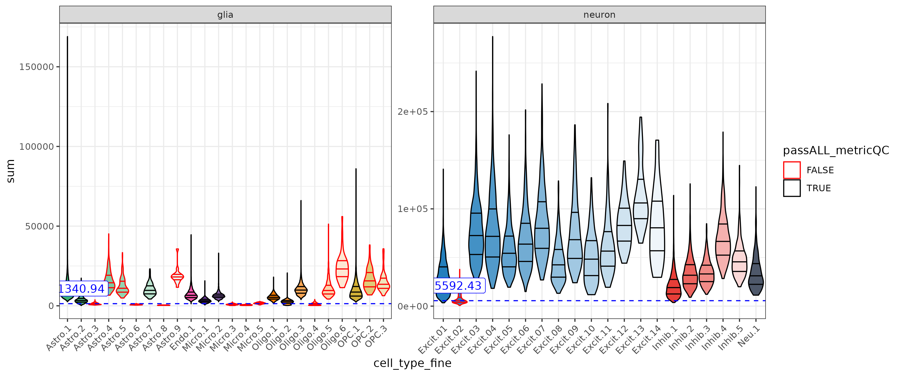
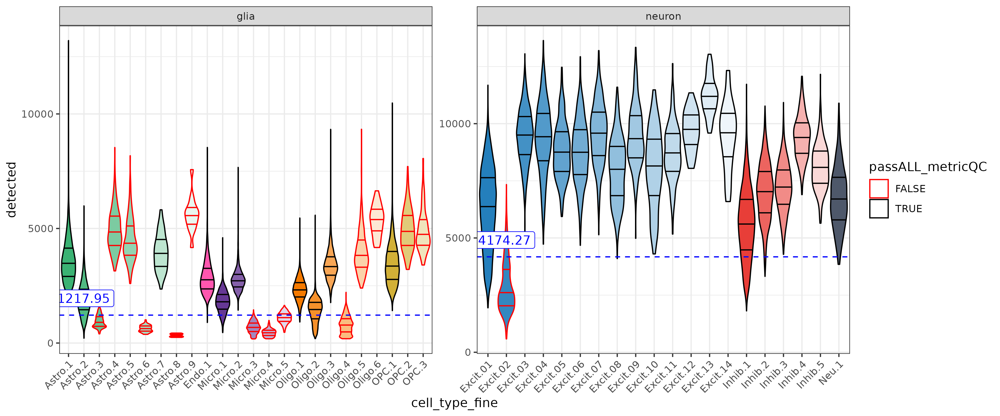
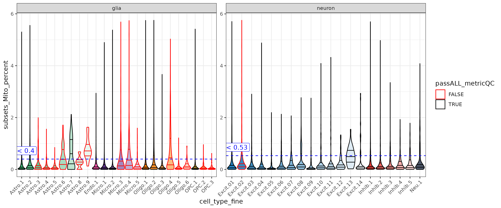
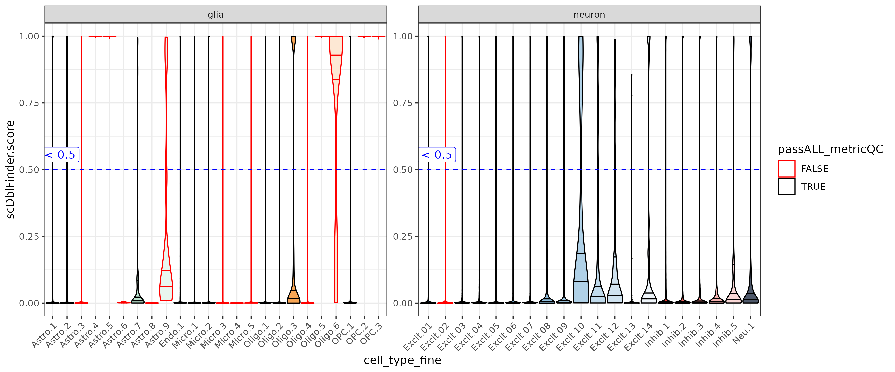
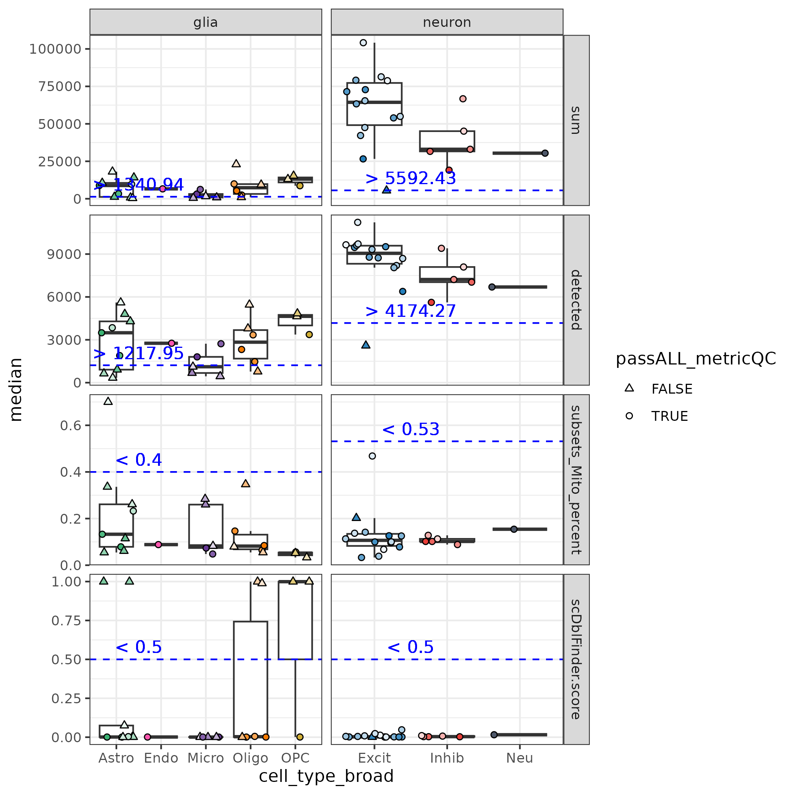
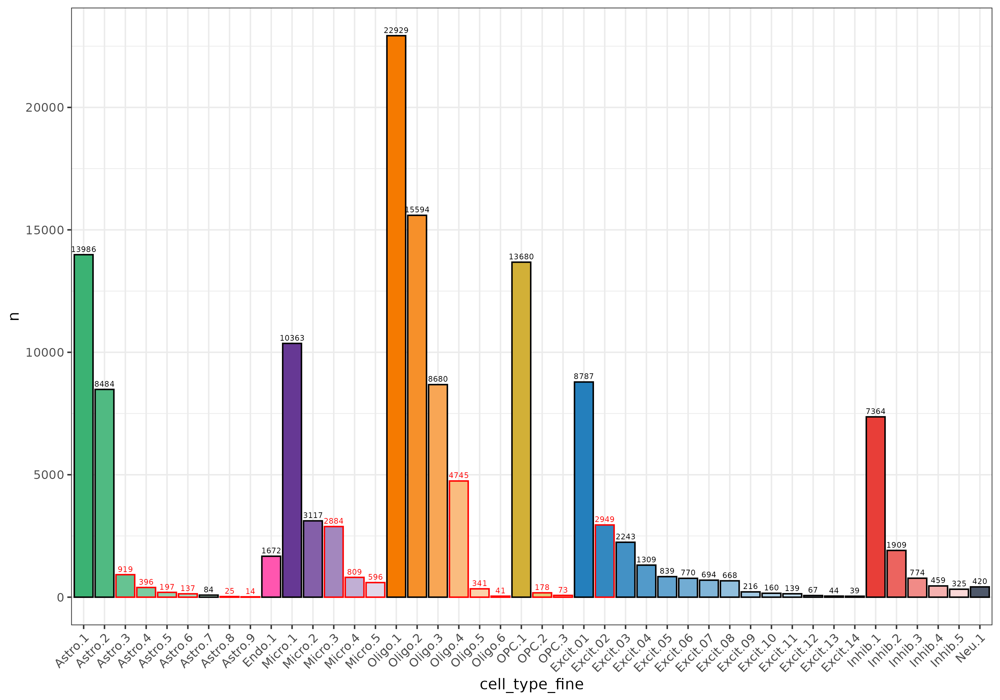
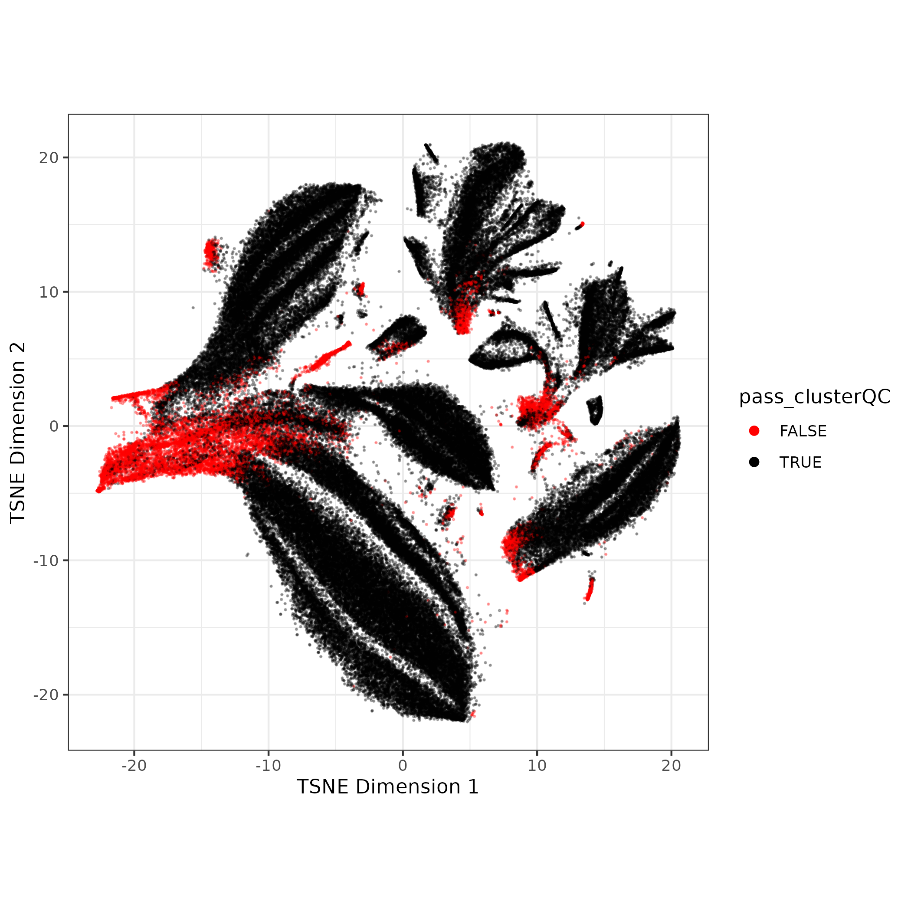
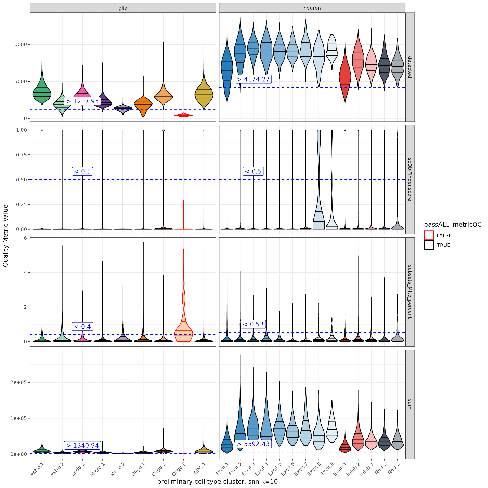
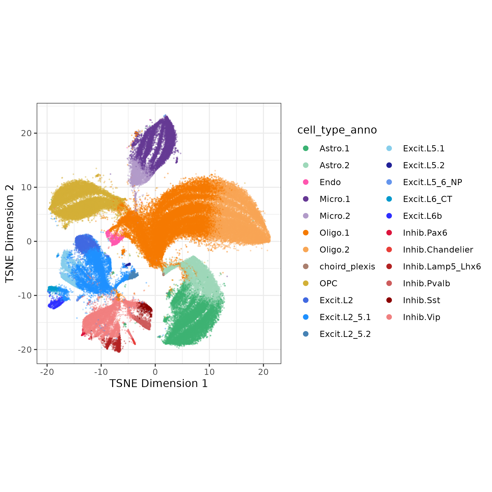

# Introduction

The goal of cluster quality control (QC) is to further identify low quality nuclei by running a preliminary clustering step, then dropping clusters with poor QC scores (high mitochondrial rate, high doublet score, low sum UMI, or low detected genes). After cluster QC, the data is re-clustered with the aim that the second 'optimal' clustering is then driven by cell type identity not quality signal.

# Get Ready

## 0. Nuclei QC

Cluster QC is run after 'nuclei' QC where droplets/nuclei are quality controlled in the following process:

1.  Evaluate each droplet for if it contains nuclei or only ambient RNA (an 'empty droplet') with `DropletUtils::emptyDrops()` , DROP empty droplets, KEEP droplets containing nuclei ([see DropletUtils docs](https://bioconductor.org/packages/release/bioc/vignettes/DropletUtils/inst/doc/DropletUtils.html))
2.  Calculate the double score for each nuclei with `scDblFinder::scDblFinder()` ([see scDBLFinder docs](https://plger.github.io/scDblFinder/index.html)), but **don't drop** yet - we'll evaluate this in the cluster QC step (It is important to do this before low quality nuclei are dropped in the next step)
3.  Nuclei are evaluated **by sample** for **high mitochondrial rate, low sum UMI, or low detected genes** with `scuttle::isOutlier()` , DROP nuclei that are over cutoff for any metrics, KEEP nuclei that pass all metrics
    -   It may be reasonable to set a hard cutoff for mitochondrial rate - we'll discuss more

After nuclei QC, you'll retain high QC nuclei with double scores, ready for clustering! But notably when evaluating brain snRNA-seq data, neurons have high levels of transcriptional activity than glia leading to different distributions of these QC metrics. This is visible in the bi-modal distributions of the nuclei sum UMI QC plots.

Some of the nuclei that look fine might be low quality neurons, but we don't know which neurons are neurons yet 🕵️! To understand what type of cells these nuclei are we'll have to cluster.


# Cluster Quality Control

## 1. Feature Selection, Dimension Reduction, and Batch Correction

To cluster the nuclei we'll need batch-corrected principal components (PCs). We won't get in to too much detail here but our current method is GLM-PCA but quickly:\

1.  Select top 2k genes (features) deviating from binomial model `scry::devianceFeatureSelection()` then calculate deviance residuals with `scry::nullResiduals()`
2.  Reduce dimensions with PCA, calculate UMAP and TSNE for visualization\
    {width="400"}
3.  Run batch correction with Harmony- the batch correction is subtle in this example\
    {width="400"}

We will use the batch-corrected PCAs for clustering.

## 2. Preliminary Clustering

The next step is to cluster the nuclei. There are many ways to optimize clustering, but to keep things simple, I recommend using a finer cluster resolution (for more but smaller clusters), but still a manageable number (\~50 clusters).

Previously we've used single-nearest-neighbors + walktrap clustering. For larger data we've started using Leiden clustering, possible starting parameters to use there are k=25, resolution = 0.3.

I used SSN with k=10, then walktrap on the ERC data (140k nuclei after QC) resulting in 44 clusters:

```         
## running single-nearest-neighbors k =10
snn.gr <- bluster::buildSNNGraph(sce, k = k, use.dimred = "HARMONY")

## Run walk trap clustering
clusters <- igraph::cluster_walktrap(snn.gr)$membership
table(clusters)

# clusters
#     1     2     3     4     5     6     7     8     9    10    11    12    13 
#  7364  1309  2884  2949 10363 13986  1909   809   596   160   919 15594   694 
#    14    15    16    17    18    19    20    21    22    23    24    25    26 
#   770   839  1672  2243  8680  8484 13680   216  4745  8787    39   420  3117 
#    27    28    29    30    31    32    33    34    35    36    37    38    39 
#   341   396   459   668 22929   774   325   137   197    44   139    41    67 
#    40    41    42    43    44 
#    73    84    25   178    14 
```

## 3. Annotate Clusters by Cell Type

Next we want a **preliminary** cell type annotation for each cluster. Cell type annotation can be tricky and time consuming, especially on low quality clusters. Here we just want to focus on classifying nuclei clusters as neurons or glia (cell_type_class).

Clusters can be classified by expression of cell type marker genes, but even at the class or broad cell cell type level that can be time consuming!

To help with this process I've used the automated cell type identification tool [ScType](https://github.com/IanevskiAleksandr/sc-type). I had to make some adaptions to run with `SingleCellExperiment` data, see [my code here](https://github.com/LieberInstitute/LFF_spatial_ERC/blob/devel/code/04_snRNA-seq/08_sctype_prelim.R).

ScType scores each cluster based on expression of marker genes from a tissue-specific database (we'll use brain). From the scores it provides a cell type classification and a measure of confidence for its classification. I used these classifications to annotate each cluster `cell_type_broad` and `cell_type_class`.

| type                            | cell_type_broad | cell_type_class |
|:--------------------------------|:----------------|:----------------|
| Astrocytes                      | Astro           | glia            |
| Endothelial cells               | Endo            | glia            |
| Microglial cells                | Micro           | glia            |
| Oligodendrocytes                | Oligo           | glia            |
| Oligodendrocyte precursor cells | OPC             | glia            |
| Glutamatergic neurons           | Excit           | neuron          |
| GABAergic neurons               | Inhib           | neuron          |
| Mature neurons                  | Neu             | neuron          |

I also assigned `cell_type_fine` as a combination of `cell_type_broad` and rank of number of nuclei within a cell type (so the Astrocyte cluster with most nuclei is `Astro.1`). Now I have a name and cell type annotation for all 44 clusters! ✅


## 4. Check Quality Metrics of Clusters

We will now evaluate clusters based on **high mitochondrial rate, low sum UMI, or low detected genes** (like in nuclei QC), and now we'll evaluate `scDblFinder score` by cluster.

For each metric the **cluster's median QC score is compared to a cell class specific cutoff** (calculated below). If the median score is below the cutoff for sum UMI or low detected genes OR above the cutoff for mitochondrial rate or doublet score the cluster will fail quality control. Often poor quality clusters will fail more than one QC evaluation.

**Sum UMI & Detected Genes \
**These metrics have different ranges between gila and neurons. With the adjusted cutoffs low quality neurons (ex. Excit.2) can be detected with out loosing too many glia.





**Mitochondrial Gene Expression**

Mitochondrial rate was low for the ERC data, and just a bit higher in neurons. For other data sets a stricter cutoff may need to be set.



**Doublet Score**

In the ERC data the `scDblFInderScore` for a cluster was either close to 0 or 1. Doublet clusters can look fine in other metrics but have super high doublet scores (ex. Astro.4 & Astro.5)



### Calculate QC Cutoffs

For the first three metrics we'll determine a cutoff for neurons and glia separately, first by grouping the nuclei by `cell_type_class`, then calculating the median value and median absolute deviation (MAD), and finally a cutoff based on those values. \

-   For sum UMI and detected, we want to keep clusters with high values (drop low), so we'll set the cutoff to be `median - 1*MAD`

-   For mitochondrial rate we want to keep clusters with low values (drop high), so so we'll set the cutoff to be `median + 3*MAD`.

-   For `scDblFInderScore` we'll use a **consistent cutoff of \>0.05**.

Below are the values from the ERC snRNA-seq data. Note the multipliers may need to be adjusted based on the data set.

| cell_type_class | metric               |   median |      mad |  cutoff | cutoff_anno |
|:-----------|:-------------|-----------:|-----------:|-----------:|:-----------|
| glia            | detected             |  2321.00 |  1103.05 | 1217.95 | \> 1217.95  |
| glia            | subsets_Mito_percent |     0.09 |     0.10 |    0.40 | \< 0.4      |
| glia            | sum                  |  4957.00 |  3616.06 | 1340.94 | \> 1340.94  |
| neuron          | detected             |  6711.00 |  2536.73 | 4174.27 | \> 4174.27  |
| neuron          | subsets_Mito_percent |     0.12 |     0.14 |    0.53 | \< 0.53     |
| neuron          | sum                  | 28592.00 | 22999.57 | 5592.43 | \> 5592.43  |

Here is another look at the cluster median QC values vs. these cutoffs in the ERC data set. Again clusters that did not pass ALL of the QC cutoffs were dropped.

\


Note many of the clusters dropped were quite small





## 5. Rinse and Repeat 🧼

After *rinsing* our data by dropping nuclei in low QC clusters, we now need to *repeat* steps 1 to 4 🔁

1.  **Feature Selection, Dimension Reduction, and Batch Correction**: by removing low quality data or "technical' signal from the data, the feature selection and reduced dimensions should now better highlight the cell type signal
2.  **Clustering**: Now is the time to optimize clustering parameters, perhaps testing multiple resolutions, to best define cell types for the data (cluster optimzation discussed elsewhere)
3.  **Annotate Clusters by Cell Type:** I'd now spend time carefully annotating cell type clusters. I found ambiguous cell types often dropped in cluster QC (maybe the doublets?) and annotation is clearer in the improved clustering. 🔎
4.  **Cluster QC**: To be extra thorough now examine the new clusters against the **same QC cutoffs**. Most of the clusters should now be in the clear of the cutoffs. In ERC we only dropped one Oligo cluster in the second round of QC.



## Done!

Finally some squeaky clean data! Ready for the next analysis 🧑‍🔬



Thanks for reading! 😀
